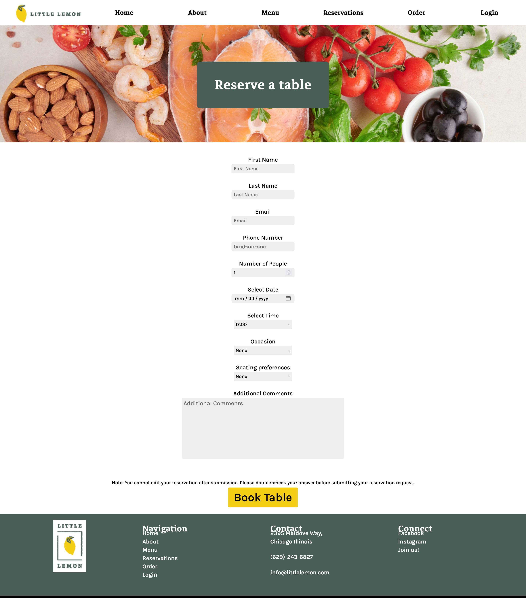

# Little Lemon Restaurant

Final capstone project for Meta Front-end developer program on Coursera, which contains a detailed and responsive website with table-booking functionality built using React.

### Deployment
Successful

## Live Demo Deployment
[Click here for Live Demo](https://abrar052.github.io/Little-Lemon-Restaurant/)

## Screenshot

### Home Page

### Booking Page

### Tech Stack:

- HTML, CSS
- JSX
- React

### Third Party Libraries & APIs:

- react-router-dom
- react-responsive-carousel
- Meta front-end table-booking API

### Install and Run:

- Run 'npm start' on the reserve-a-table folder

## Author

👤 **Abrar Hussain**

- GitHub: [@githubhandle](https://github.com/Abrar052)
- Twitter: [@twitterhandle](https://twitter.com/bc160400820)
- LinkedIn: [LinkedIn](https://www.linkedin.com/in/abrar-hussain-225589238/)

## 🤝 Contributing

Contributions, issues, and feature requests are welcome!

Feel free to check the [issues page](../../issues/).

## Show your support

Give a ⭐️ if you like this project!
